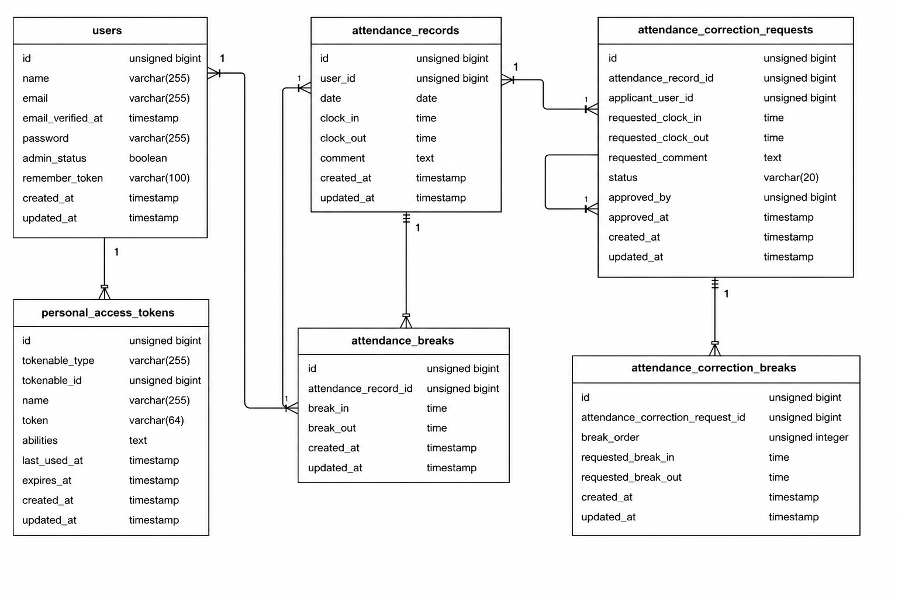

# coachtech-attendance

## アプリケーション名

COACHTECH 勤怠管理アプリ

## 前提環境

このアプリを動かすには、以下が必要です。

- Git
- Docker
- Docker Compose

GitHubからSSHでcloneする場合は、事前にGitHubのSSHキー設定が必要です。

## 環境構築

### Dockerビルド

SSHでcloneする場合

```
git clone git@github.com:yasuyasuikeikb-collab/coachtech-attendance.git
cd coachtech-attendance
docker compose up -d --build
```

HTTPSでcloneする場合

```
git clone https://github.com/yasuyasuikeikb-collab/coachtech-attendance.git
cd coachtech-attendance
docker compose up -d --build
```

コンテナが正常に起動しているか確認します。

```
docker compose ps
```

`nginx`、`php`、`mysql`、`phpmyadmin`、`mailhog` が起動していればOKです。

### Laravel環境構築

PHPコンテナに入ります。

```
docker compose exec php bash
cd /var/www
```

Composerパッケージをインストールします。

```
composer install
```

`.env` ファイルを作成します。

```
cp .env.example .env
```

アプリケーションキーを作成します。

```
php artisan key:generate
```

`.env` ファイルを作成後、以下のDB接続設定を確認してください。

```
DB_CONNECTION=mysql
DB_HOST=mysql
DB_PORT=3306
DB_DATABASE=laravel_db
DB_USERNAME=laravel_user
DB_PASSWORD=laravel_pass
```

上記のDB設定は、`docker-compose.yml` のMySQL設定と一致している必要があります。

確認する項目は以下です。

```
DB_DATABASE=laravel_db
DB_USERNAME=laravel_user
DB_PASSWORD=laravel_pass
```

メール認証確認用にMailHogを使用するため、以下のメール設定を確認してください。

```
MAIL_MAILER=smtp
MAIL_HOST=mailhog
MAIL_PORT=1025
MAIL_USERNAME=null
MAIL_PASSWORD=null
MAIL_ENCRYPTION=null
MAIL_FROM_ADDRESS=noreply@example.com
MAIL_FROM_NAME="${APP_NAME}"
```

マイグレーションとシーディングを実行します。

```
php artisan migrate:fresh --seed
```

キャッシュをクリアします。

```
php artisan optimize:clear
```

### 動作確認

ブラウザで以下にアクセスしてください。

```
http://localhost
```

ログイン画面が表示されれば、環境構築は完了です。

## 使用技術（実行環境）

- PHP 8.x
- Laravel 8.x
- MySQL 8.x
- nginx
- Docker / Docker Compose
- MailHog
- Laravel Fortify
- Laravel Sanctum

## ER図



## URL

- 開発環境：[http://localhost](http://localhost)
- phpMyAdmin：[http://localhost:8080](http://localhost:8080)
- MailHog：[http://localhost:8025](http://localhost:8025)

## ログイン情報

### 一般ユーザー

```
メールアドレス：user1@example.com
パスワード：password
```

```
メールアドレス：user2@example.com
パスワード：password
```

### 管理者ユーザー

```
メールアドレス：user3@example.com
パスワード：password
```

## 主なページ

### 一般ユーザー

- 会員登録画面：[http://localhost/register](http://localhost/register)
- ログイン画面：[http://localhost/login](http://localhost/login)
- 出勤登録画面：[http://localhost/attendance](http://localhost/attendance)
- 勤怠一覧画面：[http://localhost/attendance/list](http://localhost/attendance/list)
- 勤怠詳細画面：`/attendance/{attendanceRecord}`
- 申請一覧画面：[http://localhost/stamp_correction_request/list](http://localhost/stamp_correction_request/list)
- マイ勤怠レポート画面：[http://localhost/attendance/report](http://localhost/attendance/report)

### 管理者

- 管理者ログイン画面：[http://localhost/admin/login](http://localhost/admin/login)
- 勤怠一覧画面：[http://localhost/admin/attendance/list](http://localhost/admin/attendance/list)
- 勤怠詳細画面：`/admin/attendance/{attendanceRecord}`
- スタッフ一覧画面：[http://localhost/admin/staff/list](http://localhost/admin/staff/list)
- スタッフ別勤怠一覧画面：`/admin/attendance/staff/{staffUser}`
- スタッフ別勤怠CSV出力：`/admin/attendance/staff/{staffUser}/csv`
- 申請一覧画面：[http://localhost/stamp_correction_request/list](http://localhost/stamp_correction_request/list)
- 修正申請承認画面：`/stamp_correction_request/approve/{correctionRequest}`

## 主な機能

### 一般ユーザー機能

- 会員登録
- ログイン
- メール認証
- 出勤打刻
- 休憩開始
- 休憩終了
- 退勤打刻
- 勤怠一覧表示
- 勤怠詳細表示
- 勤怠修正申請
- 修正申請一覧表示
- マイ勤怠レポート表示

### 管理者機能

- 管理者ログイン
- 日別勤怠一覧表示
- 勤怠詳細確認
- 勤怠情報修正
- スタッフ一覧表示
- スタッフ別勤怠一覧表示
- スタッフ別勤怠CSV出力
- 修正申請一覧表示
- 修正申請承認

### API機能

- 勤怠一覧取得
- 勤怠詳細取得
- 勤怠登録
- 勤怠更新
- 勤怠削除
- SanctumによるAPI認証

## テスト環境構築

テスト用データベースを作成します。

```
docker compose exec mysql mysql -u root -proot -e "CREATE DATABASE IF NOT EXISTS laravel_test CHARACTER SET utf8mb4 COLLATE utf8mb4_unicode_ci;"
```

テスト用データベースに権限を付与します。

```
docker compose exec mysql mysql -u root -proot -e "GRANT ALL PRIVILEGES ON laravel_test.* TO 'laravel_user'@'%'; FLUSH PRIVILEGES;"
```

上記コマンドの `-proot` は、MySQLのrootパスワードが `root` の場合の指定です。  
`docker-compose.yml` の `MYSQL_ROOT_PASSWORD` が異なる場合は、その値に合わせて変更してください。

PHPコンテナに入ります。

```
docker compose exec php bash
cd /var/www
```

`.env.testing` ファイルを作成します。

```
cp .env.example .env.testing
```

`.env.testing` ファイルのDB接続設定を以下のように変更してください。

```
APP_ENV=testing
DB_CONNECTION=mysql
DB_HOST=mysql
DB_PORT=3306
DB_DATABASE=laravel_test
DB_USERNAME=laravel_user
DB_PASSWORD=laravel_pass
MAIL_MAILER=array
```

テスト環境用のアプリケーションキーを作成します。

```
php artisan key:generate --env=testing
```

テストを実行します。

```
php artisan test
```

## API

### 勤怠一覧取得

```
GET /api/v1/attendance-records
```

### 勤怠詳細取得

```
GET /api/v1/attendance-records/{attendanceRecord}
```

### 勤怠登録

```
POST /api/v1/attendance-records
```

### 勤怠更新

```
PUT /api/v1/attendance-records/{attendanceRecord}
```

### 勤怠削除

```
DELETE /api/v1/attendance-records/{attendanceRecord}
```

APIの登録・更新・削除にはSanctumによる認証が必要です。

## 補足

管理者は `/admin/login` からログインできます。

通常の `/login` から管理者アカウントでログインした場合も、管理者画面に遷移します。

勤怠ステータスはDBに保存せず、勤怠情報から計算しています。

- 当日の勤怠がない：勤務外
- 出勤済みで退勤していない：出勤中
- 休憩開始済みで休憩終了していない：休憩中
- 退勤済み：退勤済